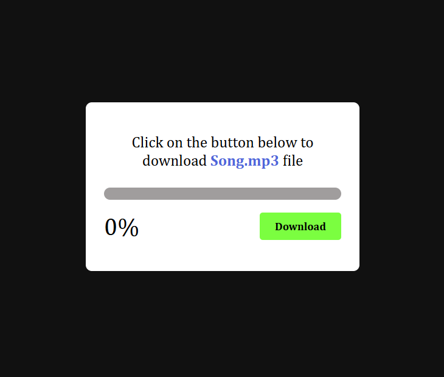
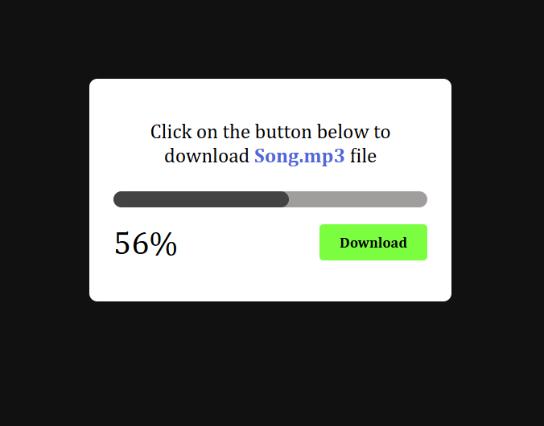
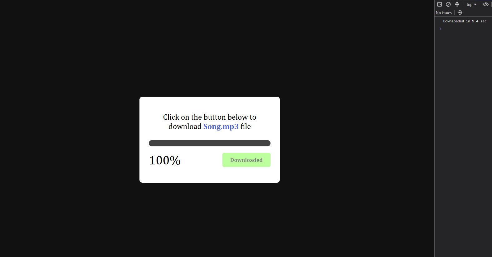

# Download Loading Effect

A simple JavaScript project that creates a **download loading effect** using `setInterval()` and `setTimeout()`.

### Screenshot

### Features

* Shows download progress from **0% to 100%**
* Uses `setInterval()` for the loading progress
* Uses `setTimeout()` to complete the download
* Download time is **randomly generated**
* Button gets disabled while downloading to prevent multiple clicks
* Button changes to **"Downloaded"** after completion

### Technologies

* HTML
* CSS
* JavaScript

### Concepts Used

* `setInterval()`
* `setTimeout()`
* `clearInterval()`
* `Math.random()`
* DOM Manipulation
* Event Listeners
* `pointerEvents`

### How It Works

When the user clicks **Download**, a random download time is generated. The progress bar and percentage increase using `setInterval()`. After the download is complete, `setTimeout()` stops the interval and changes the button to **Downloaded**.
